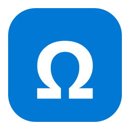

# WinKeySymb ⚡

<p align="center">
  
</p>

<p align="center">
  <strong>Fast, native Windows special character picker summoned via global hotkey.</strong><br>
  <em>Think of the <code>Win + .</code> menu, but dedicated to special characters, math symbols, Greek letters, arrows, fractions, and typography — not GIFs.</em>
</p>

<p align="center">
  <a href="https://github.com"></a>
  <a href="https://github.com"></a>
  <a href="https://github.com"></a>
  <a href="https://github.com"></a>
</p>

---

## 📥 Download & Installation

### Option 1: Download from GitHub Releases (Recommended for Users)

1. Go to **[Releases](../../releases)**.
2. Download either:
   - **`WinKeySymb.exe`** (standalone executable — no installation required, run directly).
   - **`WinKeySymb-windows-x64.zip`** (includes installer script).
3. If using the zip, extract it and right-click **`install.ps1`** ➔ *Run with PowerShell*.
   - Installs to `%LOCALAPPDATA%\Programs\WinKeySymb\`
   - Adds shortcuts to your **Start Menu** and **Desktop**
   - Launches immediately in your system tray!

---

### Option 2: Run / Build from Source with `uv`

If you have [`uv`](https://github.com/astral-sh/uv) installed:

```powershell
# Clone the repository
git clone https://github.com/hrflr/winkeysymb.git
cd winkeysymb

# Run directly (isolated virtual environment)
uv run python main.py

# Or build the standalone executable
uv run python build.py
```

---

## ✨ Features

- **Global Hotkey (`Win + Alt + C`)**:
  - Summon the search popup from anywhere in Windows (browsers, Word, code editors, terminals, Slack, Discord).
  - Configurable hotkey: switch between `Win + Alt + C`, `Win + Alt + Space`, `Alt + Shift + Space`, or `Ctrl + Alt + Space` via the tray icon.
- **Intelligent Real-Time Search**:
  - Natural keywords, aliases, and LaTeX syntax:
    - `alpha` or `\alpha` ➔ **α**
    - `approx` or `~~` ➔ **≈**
    - `!=` or `neq` ➔ **≠**
    - `->` ➔ **→**
    - `=>` ➔ **⇒**
    - `+-` or `pm` ➔ **±**
    - `1/2` ➔ **½**
    - `deg` ➔ **°**
    - `euro` ➔ **€**
    - `star` ➔ **★**
    - `check` ➔ **✓**
    - `emdash` or `--` ➔ **—**
  - Fallback Unicode search across standard Unicode character databases.
- **Instant Insertion**:
  - Press **`Enter`** to insert the top match immediately.
  - Or click any character with your mouse or navigate with **`↑ / ↓`** arrows.
  - Injected directly into the previously active window using Windows `SendInput` (Unicode mode, does not clobber your clipboard, and also copies to clipboard).
  - Press **`Esc`** to close.
- **Recent Characters**:
  - Automatically remembers your most recently and frequently used characters when the search bar is empty.
- **System Tray Resident**:
  - Lives unobtrusively in the Windows notification area (`Ω` icon).
  - Easy toggle for *Start with Windows* on boot.
- **Lightweight & Self-Contained**:
  - Packaged as a single `.exe` without requiring Python to be installed on end-user machines.

---

## ⌨️ Controls & Shortcuts

| Action                              | Control                                                 |
| ----------------------------------- | ------------------------------------------------------- |
| **Summon Search Window**            | `Win + Alt + C` *(or custom tray hotkey)*               |
| **Insert Top / Selected Character** | `Enter`                                                 |
| **Insert Specific Character**       | Click item or navigate with `↑` / `↓` and press `Enter` |
| **Close Window**                    | `Esc`                                                   |
| **Open Tray Menu**                  | Right-click the `Ω` icon in system tray                 |

---

## 📂 Project Structure

```
winkeysymb/
├── .github/
│   └── workflows/
│       └── release.yml     # Automated GitHub Release CI/CD workflow
├── assets/
│   ├── icon.ico            # Windows application icon
│   └── icon.png            # High-resolution PNG logo
├── winkeysymb/
│   ├── __init__.py
│   ├── app.py              # Main application coordinator
│   ├── config.py           # Settings & recent character persistence
│   ├── hotkey.py           # Win32 RegisterHotKey background listener
│   ├── injector.py         # Win32 SendInput Unicode character injection
│   ├── data/
│   │   ├── symbols.py      # Curated database (math, greek, typography, arrows...)
│   │   └── search.py       # Scored search & Unicode character matching
│   └── ui/
│       ├── picker.py       # Modern Win11/Spotlight-style floating search UI
│       └── tray.py         # System tray icon and context menu
├── build.py                # Standalone PyInstaller build script & zip packager
├── install.ps1             # One-click Windows PowerShell installer
├── main.py                 # Application entry point
├── pyproject.toml          # Project configuration & dependencies
└── LICENSE                 # MIT License
```


Made with Antigravity (3.8 Flash), audited with Opus 4.6

Licensed under the [MIT License](LICENSE).
